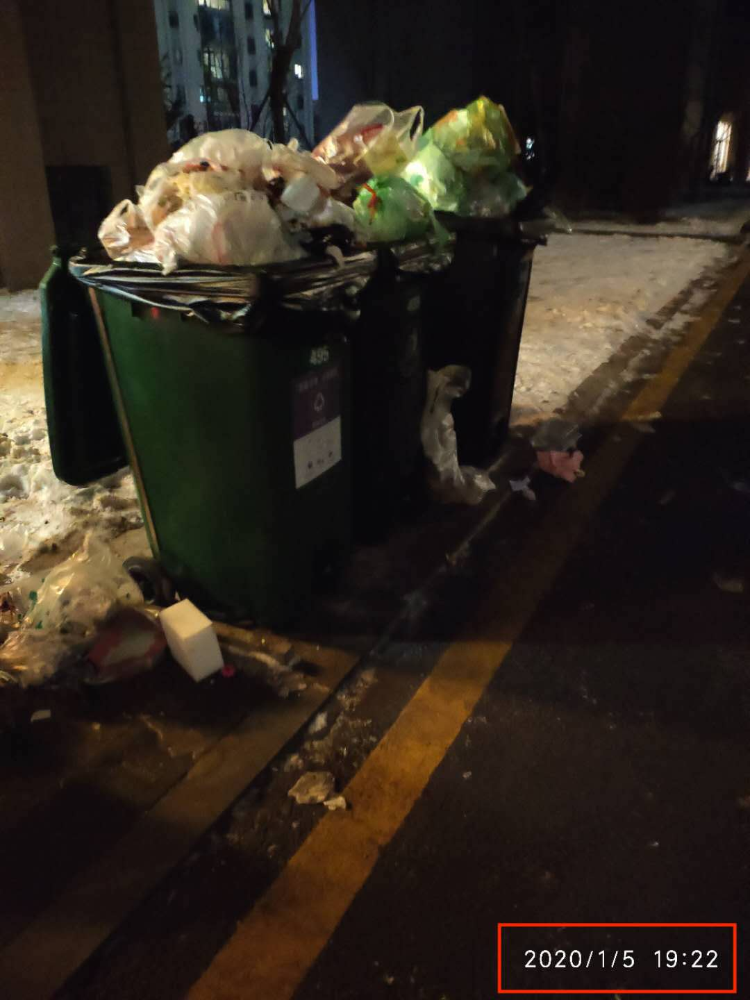

# BGY-Redemption

# 碧桂园业主自我救赎指南

> 准备写一些东西，关于碧桂园业主如何自我救赎相关的东西，不知道能不能坚持住，90%可能坚持不住

## 如何报修

以下两种方式经确认是没有任何效果的

1. 联系管家报修
2. 拨打400电话报修

上述两种方式得到的答复是“帮您登记了，后期会有相关人员联系您”，但是然并卵

所以推荐下面这种方式，请按步骤操作

1. 编写报修问题描述文字，注意配图
2. 发微博并@碧桂园
3. 在碧桂园贴吧发帖子
4. 发邮件给 khfw@countrygarden.com.cn

## 如何取证

1. 针对想要报修或者投诉问题，定期拍照留存，同时照片上追加日期水印

   

2. 与相关人员的通话一定要开启录音功能，如果是苹果手机请自行百度“苹果手机 通话录音”

